# BetterBlog Architecture Diagram

## System Architecture Overview

```mermaid
graph TB
    subgraph Client["🔌 Client/API Consumers"]
        WEB["Web Browser"]
        MOBILE["Mobile App"]
        EXTERNAL["External API Clients"]
    end

    subgraph API["🌐 REST API Layer - Controllers"]
        AC["AuthController"]
        UC["UserController"]
        PC["PostController"]
        SC["ShareLinkController"]
        ALC["ActivityLogController"]
        ATC["ApiTokenController"]
        ADMIN["AdminController"]
    end

    subgraph Security["🔐 Security & Configuration"]
        JWTF["JwtFilter"]
        SC_CONFIG["SecurityConfig"]
        CUD["CustomUserDetailsService"]
        RATE["RateLimiterService"]
    end

    subgraph Service["⚙️ Business Logic Layer - Services"]
        AS["AuthService"]
        US["UserService"]
        PS["PostService"]
        SS["ShareLinkService"]
        ALS["ActivityLogService"]
        ATS["ApiTokenService"]
        JS["JwtService"]
    end

    subgraph DTO["📦 Data Transfer Objects"]
        AUTH_DTO["AuthRequest/Response"]
        USER_DTO["UserRequest/Response"]
        POST_DTO["PostRequest/Response"]
        SHARE_DTO["ShareLinkRequest/Response"]
        TOKEN_DTO["ApiTokenRequest/Response"]
    end

    subgraph Repository["💾 Data Access Layer - Repositories"]
        UR["UserRepository"]
        PR["PostRepository"]
        SR["ShareLinkRepository"]
        ALR["ActivityLogRepository"]
        ATR["ApiTokenRepository"]
    end

    subgraph Entity["📋 Domain Model - Entities"]
        USER["User"]
        POST["Post"]
        SHARE["ShareLink"]
        ACT["ActivityLog"]
        TOKEN["ApiToken"]
    end

    subgraph Database["🗄️ MongoDB"]
        USERS_DB["users collection"]
        POSTS_DB["posts collection"]
        SHARE_DB["sharelinks collection"]
        ACT_DB["activitylogs collection"]
        TOKEN_DB["apitokens collection"]
    end

    %% Client to API
    WEB --> AC & UC & PC
    MOBILE --> AC & PC
    EXTERNAL --> ATC

    %% API to Security
    AC --> JWTF
    UC --> JWTF
    PC --> JWTF
    SC --> JWTF
    ATC --> JWTF
    JWTF --> SC_CONFIG
    SC_CONFIG --> CUD
    RATE -.->|Rate Limiting| Service

    %% API to Service
    AC --> AS & JS
    UC --> US
    PC --> PS
    SC --> SS
    ALC --> ALS
    ATC --> ATS
    ADMIN --> US & PS

    %% Service to DTO
    AS -.->|Converts| AUTH_DTO
    US -.->|Converts| USER_DTO
    PS -.->|Converts| POST_DTO
    SS -.->|Converts| SHARE_DTO
    ATS -.->|Converts| TOKEN_DTO

    %% Service to Repository
    AS --> UR
    US --> UR
    PS --> PR & UR
    SS --> SR & PR & UR
    ALS --> ALR
    ATS --> ATR & UR

    %% Repository to Entity
    UR --> USER
    PR --> POST
    SR --> SHARE
    ALR --> ACT
    ATR --> TOKEN

    %% Entity Relationships
    POST -->|author| USER
    SHARE -->|createdBy| USER
    SHARE -->|post| POST

    %% Entity to Database
    USER --> USERS_DB
    POST --> POSTS_DB
    SHARE --> SHARE_DB
    ACT --> ACT_DB
    TOKEN --> TOKEN_DB

    %% Styling
    classDef client fill:#e1f5ff,stroke:#01579b,stroke-width:2px
    classDef api fill:#fff3e0,stroke:#e65100,stroke-width:2px
    classDef security fill:#f3e5f5,stroke:#4a148c,stroke-width:2px
    classDef service fill:#e8f5e9,stroke:#1b5e20,stroke-width:2px
    classDef dto fill:#fce4ec,stroke:#880e4f,stroke-width:2px
    classDef repository fill:#e0f2f1,stroke:#004d40,stroke-width:2px
    classDef entity fill:#f1f8e9,stroke:#33691e,stroke-width:2px
    classDef database fill:#ede7f6,stroke:#311b92,stroke-width:2px

    class WEB,MOBILE,EXTERNAL client
    class AC,UC,PC,SC,ALC,ATC,ADMIN api
    class JWTF,SC_CONFIG,CUD,RATE security
    class AS,US,PS,SS,ALS,ATS,JS service
    class AUTH_DTO,USER_DTO,POST_DTO,SHARE_DTO,TOKEN_DTO dto
    class UR,PR,SR,ALR,ATR repository
    class USER,POST,SHARE,ACT,TOKEN entity
    class USERS_DB,POSTS_DB,SHARE_DB,ACT_DB,TOKEN_DB database
```



## Architecture Layers

### 1. **Client Layer** 🔌
- Web browsers, mobile applications, and external API consumers

### 2. **REST API Layer (Controllers)** 🌐
- **AuthController**: Authentication and user login/registration
- **UserController**: User profile management
- **PostController**: Blog post CRUD operations
- **ShareLinkController**: Shareable link management
- **ActivityLogController**: Activity tracking
- **ApiTokenController**: API token management
- **AdminController**: Administrative operations

### 3. **Security & Configuration Layer** 🔐
- **JwtFilter**: JWT token validation middleware
- **SecurityConfig**: Spring Security configuration
- **CustomUserDetailsService**: Custom user authentication
- **RateLimiterService**: API rate limiting

### 4. **Business Logic Layer (Services)** ⚙️
- **AuthService**: Authentication business logic
- **UserService**: User management business logic
- **PostService**: Post management business logic
- **ShareLinkService**: Share link business logic
- **ActivityLogService**: Activity logging
- **ApiTokenService**: API token management
- **JwtService**: JWT token generation and validation

### 5. **Data Transfer Objects (DTOs)** 📦
- Request/Response objects for API contracts
- Decouples entities from API clients

### 6. **Data Access Layer (Repositories)** 💾
- **UserRepository**: MongoDB user collection operations
- **PostRepository**: MongoDB post collection operations
- **ShareLinkRepository**: MongoDB share link operations
- **ActivityLogRepository**: MongoDB activity log operations
- **ApiTokenRepository**: MongoDB API token operations

### 7. **Domain Model (Entities)** 📋
- **User**: User account and profile information
- **Post**: Blog post content and metadata
- **ShareLink**: Public share links for posts
- **ActivityLog**: User activity tracking
- **ApiToken**: API authentication tokens

### 8. **Database Layer** 🗄️
- **MongoDB**: NoSQL document database with the following collections:
  - `users`: User documents
  - `posts`: Post documents
  - `sharelinks`: Share link documents
  - `activitylogs`: Activity log documents
  - `apitokens`: API token documents

## Entity Relationships

```
User (1) ──── (Many) Post
         └──── (Many) ShareLink
         └──── (Many) ApiToken
         └──── (Many) ActivityLog

Post (1) ──── (Many) ShareLink
```

## Technology Stack

- **Framework**: Spring Boot 3.x
- **Database**: MongoDB (NoSQL)
- **Authentication**: JWT (JSON Web Tokens)
- **Security**: Spring Security
- **ORM**: Spring Data MongoDB
- **Build Tool**: Maven
- **Language**: Java 21

## Request Flow

```
Client Request
    ↓
JwtFilter (Validate Token)
    ↓
Controller (Route Request)
    ↓
Service (Business Logic)
    ↓
Repository (Data Access)
    ↓
MongoDB (Persist/Retrieve)
    ↓
Entity ← DTO (Convert)
    ↓
Response → Client
```

## Key Features

✅ **Authentication**: JWT-based authentication with custom user details service
✅ **Authorization**: Role-based access control (USER, MODERATOR, ADMIN)
✅ **Rate Limiting**: API rate limiting to prevent abuse
✅ **Activity Logging**: Comprehensive activity tracking
✅ **Blog Management**: Full CRUD operations for blog posts
✅ **Sharing**: Public share links for blog posts
✅ **API Tokens**: User-generated API tokens for external integrations
✅ **Indexing**: MongoDB indexes on frequently queried fields (email, username, slug)

